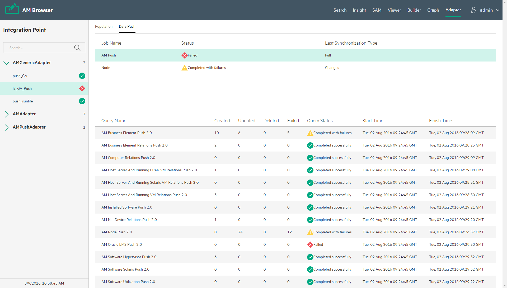

# AM Browser Adapter

AM Browser has two features that are related to HPE UCMDB:

- Adapter: Monitor AM-UCMDB Adapters status
- UCMDB Browser: Open the specified UCMDB Browser to federate CI information. This feature requires that the UCMDB CI is pushed with global_id.



### Monitor AM Adapters status

AM Admin user often needs to log on to UCMDB to check AM apdaters status. Now you can monitor AM adapters in AM Browser.

Before the AM REST service starts, you need to configure the UCMDB information in `package.properties`:

```
# Configurations for push adapter monitor
# Whether the monitor push adapter monitor is enabled
PushAdapter.Monitor.Enabled=false
# The UCMDB Server Host name
UCMDB.Server.Host=
# The UCMDB Server Port
UCMDB.Server.Port=8080
# The UCMDB Server log in User
UCMDB.Server.User=
# The UCMDB Server log in password
# The promptForPwd and encrypt parameters apply to this property,
# so this value may be overridden by a value input at deploy time and/or encrypted.
UCMDB.Server.Password=
```
And enable `ucmdb.apdater=true` in the `am-browser-config.properties` file.

```
[ucmdb]
adapter = true
```

#### Features

Below are features implemented in AMB Adapter modules.

##### Dynamic status

When you stay on the Adapter page, AM Browser will automatically retrieve status.

##### Integration points

There are 3 AM adapters displayed here:

- AM Adapter (Population Adapter)
- AM Push Adapter (Push Adapter)
- AM Generic Adapter (Both Populate and Push adapter)

##### Populate and push jobs

There are 2 tabs displaying populate or push jobs.

##### Details statistics

Display populate or push job results.

##### Warning and errors

Warning or error will be displayed with different icons.


### UCMDB Browser Federation

In the `am-browser-config.properties` file.

```
[ucmdb]
browser_server = ucmdbhost
browser_port = 8080
browser_param = /ucmdb-browser/ucmdb_widget.jsp?server=Default%20Client&locale=en#widget=properties;refocus-selection=
```

When `GlobalId` field is added in the AMB view, on the detail page, you will see a link on GlobalId to open `UCMDB Browser`.

