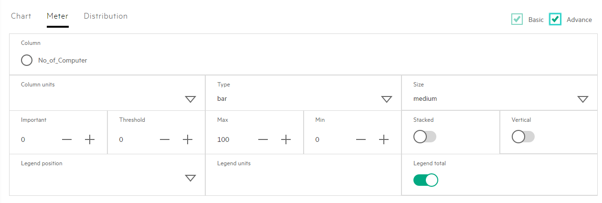
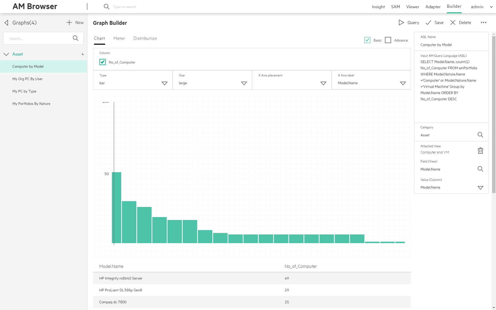

# AM Browser Graph

The Graph module provides data query, statistics and visual graph features. Admin users can input AQL (Asset Manager Query Language) to query data. It is easy to configure a Graph for presenting aggregation data.

## Graph styles and designer
Currently, there are 3 types of Graphs with designer. These graphs are built with original Grommet components, each Grommet component has several sub types:

- Chart: Bar, Line, Area
- Meter: Bar, Arc, Circle, Spiral
- Distribution

> We recommend that you use aggregation AQL to query data and configure Graph.

## AQL data and configuration

Admin user inputs aggregation AQL, like: `select seBasis, count(*) from amNature group by seBasis`

- Preview
- Configure Graph form
- Attached view

### Preview

After you input an aggregation AQL, you can use Preview to get a query result. It should have some columns.

> It is suggested to have the first column as the group by field and the second column as `count(*)` or `sum(<field name>)`.

**Below functions are not supported in AQL functions**

<table>
    <tr>
         <th colspan='6' align='left'>Reference</th>
    </tr>
    <tr>
        <td>NullTime()</td>
        <td>NullBlob()</td>
        <td>NullMemo()</td>
        <td>NullString()</td>
        <td>NullDate()</td>
        <td>NullTimeStamp()</td>
    </tr>
    <tr>
        <td>Trunc()</td>
        <td>TextToTime()</td>
        <td>DataLength()</td>
        <td>Ceil()</td>
        <td>Floor()</td>
        <td>NumberToTime()</td>
    </tr>
</table>

### Configure Graph designer

After getting a query result table with some columns,  you can create a graph from the Graph designer. Specify the value of **Column** with one of columns in the query result table.

#### Basic properties
- **Column** (mandatory)
> Ater you query with an AQL, it displays some options in the column. **Column** options will only dipslay numeric fields. In Chart, options are displayed as checkboxes for multiple selections. In Meter or Distribution, options are displayed as radio boxes for single selection.

- Label
    - X Axis label in Chart
    - Column units in Meter
    - Label in Distribution
- Other properties
    - Type
    - Size
    - X Axis placement in Chart

#### Advanced properties
-  Legend properties
    - Legend position
    - Legend units
    - Legend total
-  Details(in Chart and Meter) properties
    - Important
    - Threshold
    - Max
    - Min
- Other properties
    - Points in Chart
    - Stacked in Meter
    - Vertical in Meter

### Attached View

Attach a graph with a view and then can click an element, a page will pop up and show filtered records. You can input Field and select Value to configure the filter.
>If you input aggregation AQL, it will display some columns, **Value** is one of the columns.

>**Field** is one of the columns in the View.

- Field and Value is null. When you click an element, it will query the complete set of data in the View.
- Field and Value is not null. It means you put the **Value** values as a condition to the Field, it will query with this condition in the VIEW and return a subset of View.

## Example

To create a Graph:

> 

> 1. Click the New Tab to create a new Graph.

> 2. Input the Name and aggregation AQL in the right side text area, then it will display a records list.

> 3. Input Category to define the main menu item in the left side bar.

> 4. Select options in Column, a Graph will be displayed (if there is no options, check the AQL). Then configure parameters for the Graph are displayed.

> 5. Try these functions: Query, Save, Delete, Mail and Download.

If you want to click the element of Graph to get a record list view, you should click Attached View, select a existing View and configure Field and Value.
