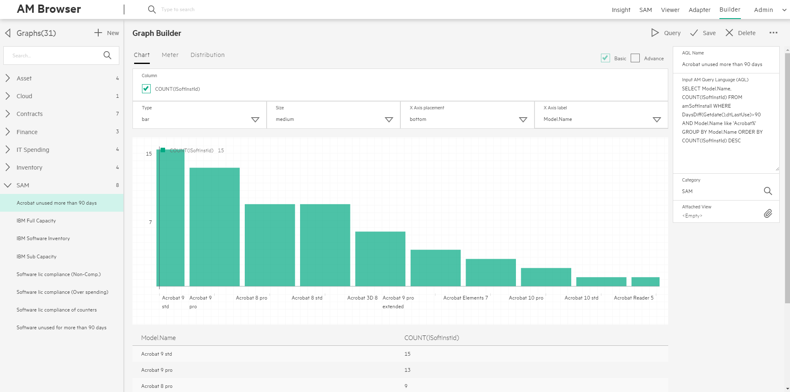

# AM Browser Graph

The Graph module provides data query, statistics and visual graph features. Admin users can input AQL (Asset Manager Query Language) to query data, for those aggregation data, it is easy to configure a Graph for presenting.

### Graph styles and designer
Currently, there are 3 types of Graph with designer. These graphs are built with original Grommet components, each Grommet component has several sub types:

- Chart: Bar, Line, Area
- Meter: Bar, Arc, Circle, Spiral
- Distribution

> Recommend use aggregation AQL to query data to configure Graph.

### AQL data and configuration

Admin user inputs aggregation AQL, like: `select seBasis, count(*) from amNature group by seBasis`

- Preview
- Configure Graph form
- Attached view

#### Preview

After you input aggregation AQL, you can use Preview to get a query result. It should have some columns.

> It is suggested to have the first column as the group by field and the second column as `count(*)` or `sum(<field name>)`.

**Below functions are not supported in AQL functions**

<table>
    <tr>
         <th colspan='6' align='left'>Reference</th>
    </tr>
    <tr>
        <td>NullTime()</td>
        <td>NullBlob()</td>
        <td>NullMemo()</td>
        <td>NullString()</td>
        <td>NullDate()</td>
        <td>NullTimeStamp()</td>
    </tr>
    <tr>
        <td>Trunc()</td>
        <td>TextToTime()</td>
        <td>DataLength()</td>
        <td>Ceil()</td>
        <td>Floor()</td>
        <td>NumberToTime()</td>
    </tr>
</table>

#### Configure Graph designer

After getting a query result table with some columns,  you can create a graph from Graph designer. Specify **Column** of Graph designer from one of columns in the query result table.

##### Basic properties
- **Column** (mandatory)
> Ater query AQL, it should display some options in column. **Column** options will only dipslay numeric fields. In Chart, options are displayed as checkbox for multipule selection, In Meter or Distribution, options are displayed as radio box for single selection.

- Label
    - X Axis label in Chart
    - Column units in Meter
    - Label in Distribution
- Other properties
    - Type
    - Size
    - X Axis placement in Chart

##### Advance properties
-  Legend properties
    - Legend position
    - Legend units
    - Legend total
-  Details(in Chart and Meter) properties
    - Important
    - Threshold
    - Max
    - Min
- Other properties
    - Points in Chart
    - Stacked in Meter
    - Vertical in Meter

#### Attached View

Attach a graph with a View, then you can click an element. A page will pop up and show records list as filtered result. You should  input Field and select Value to configure the filter.
>IF you input  aggregation AQL, it will display some columns, **Value** is one of the columns.

>**Field** is one of the columns in the View.

- Field and Value is null. When you click an element, it will query the complete set of data in the View.
- Field and Value is not null. It means you put the **Value** values as a condition to the Field, will query with this condition in the VIEW .And return a subset of View.

### Example

To create a Graph like below:

> 

> 1. Click New Tab to create a new Graph.

> 2. Input the Name and aggregation AQL in the right textarea, then it will display a records list.

> 3. Input Category to define the main menu item in the left bar.

> 4. Select options in Column, a Graph will display (if there is no options, please check up AQL). Then configure parameters for Graph display

> 5. Try these functions: Query, Save, Delete, Mail and Download.

If you want to click the element of Graph to get a records list view. You should click Attached View, select a existing View and configure Field and Value.
