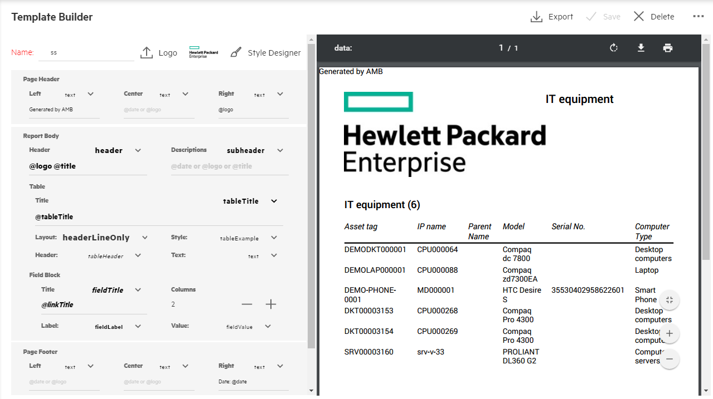
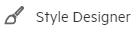
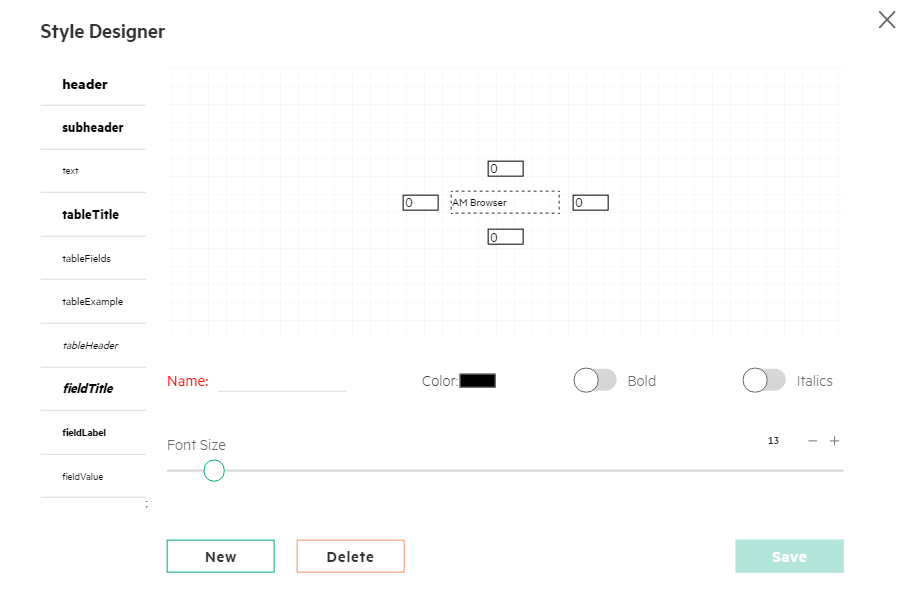

# AM Browser Template Builder
A template is a collection of certain styles defined to format reports. AM Browser allow you to build, manage, share and apply template to your printing or downloading report.  

Beside the header menu, there are major two panels for template builder as follow from left to right:

- Style defining panel
- Preview panel  

## Header Menu
The header menu includes few functionalities as follow from left to right:

  - Export -- Enable you to decide the amount and beginning point from exporting records
  - Save -- Save defined template
  - Delete  -- Remove a defined template
  - Misc menu -- The dropdown menu has two menus:

      - Preview -- Manually trigger a preview action for preview panel
      - Duplicate -- Create a duplicate template from existing one

## Style defining panel
AM Browser allows you to provide styles to your report's:

  - Page header
  - Report body
  - Page footer
  - Page Orientation

### Logo upload
AM Browser provides ability of uploading you logo of your organization and attach it to generated reports.  
To upload a logo, click on  button, select logo picture of your organization through file manager of operating system.  
After uploading process completed, logo picture on the right side of logo button would reflect your changes.

### Style Designer  
AM Browser extracts few components of report and made built-in styles for them.

Click on  button to access them.
In the pop up Style Designer layer page, you will see all built-in styles including Header, sub header, text, table Title, field Title etc.

AM Browser allows you to refine the built-in styles as you need.
For example, you might need to increase its font size, change its text color, make the text bold or italics.
All of them, AM Browser enables you to do them. As well, there is a preview panel to reflect your changes.

In addition, you may want to keep built-in styles and create a new style. To create a new style, you need to give it a proper name, which will be used in style defining panel with format of @name.

## Preview panel
AM Browser can detect changes to styles made by you. It refresh preview panel automatically to sync with your style modifications.  
To allow preview records with styles efficiently, AM Browser limit the number of previewing records to 10.  
Creating a template, AM Browser provides you demo records to enable you review your styles changes.
