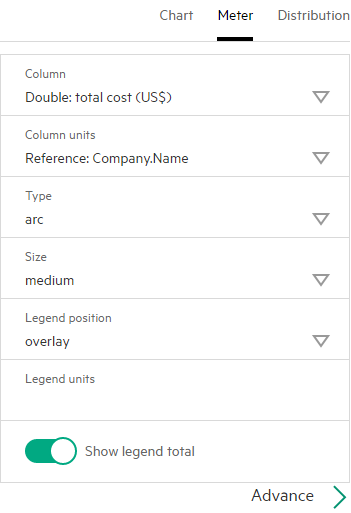

# AM Browser Graph

The Graph module provides data query, statistics and visual graph features. Admin users can input AQL (Asset Manager Query Language) to query data, for those aggregation data, it is easy to configure a Graph for presenting.

### Graph styles and designer
Currently, there are 3 types of Graph with designer. These graphs are built with original Grommet components, each Grommet component has several sub types:

- Chart: Bar, Line, Area
- Meter: Bar, Arc, Circle, Spiral
- Distribution

> Only aggregation AQL query data can be configured in Graph designer.

### AQL data and configuration

Admin user inputs aggregation AQL, like: `select seBasis, count(*) from amNature group by seBasis`

- Preview
- Load from existing AM Widgets
- Configure Graph form
- Link to a view

#### Load widgets
It allows you to import existing AM Widget AQL from the AM server directly.

#### Preview

After input aggregation AQL, you can use Preview to get a query result. It should have some columns.

> It is suggested to have the first column as the group by field and the second column as `count(*)` or `sum(<field name>)`.

> Some AQL functions can't work currently, for example: `IsNull`

#### Configure Graph designer

After getting a query result table with some columns,  you can create a graph from Graph designer. Specify **`Column`** of Graph designer from one of columns in the query result table.

- **Column** (mandatory)
- label (mandatory if link to view)
    - X Axis label in Chart
    - Column units in Meter
    - Label in Distribution
- Other properties
    - Type
    - Size
    - Others ...



#### Link to a view

Attach a graph with a view, then you can click an element. A page will pop up and show records list as filtered result. Here is a simple rule when you provide AQL:

> **The column is selected as label in Graph designer, that name will be used as a condition filter passed to view**  

For example:
```
Company.Name='Dell Computer'
```

