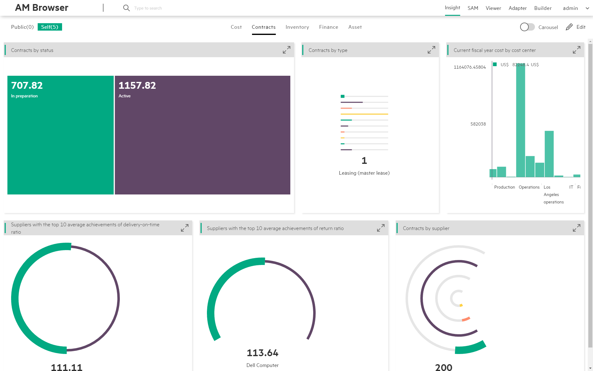
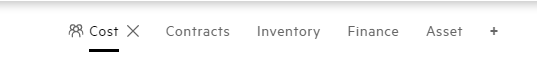
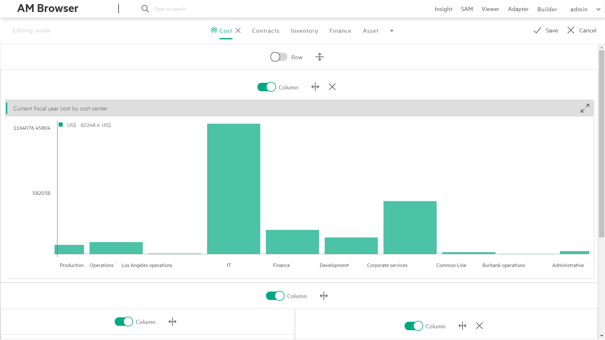

# AM Browser Insight

Insight is a new type of report, Admin user and Power user can save their own reports.

## Visible styles
There are two Visible styles:

- Public(default):  
    All users, have accessing rights to Insight module, accept a published graphs report called **Overall** from user **Admin**. All changes user Admin made for **Overall** graph report will be synchronized for other users.
- Self:  
    Define your own graphs report. AM Browser allows you to attach or remove a graph from report, make a graph to be showed horizontally or vertically, bind two graphs in row and etc.

## Display styles

There are two modes to present report:

- Flat(default): Displays Graphs on a single page as per designed layout.

- Carouse: Automatically displays Graphs one by one every 10 seconds.

(If interval of 10 seconds are too long to you, click arrow button switching to next graph manually.)

>Carousel or not Carousel display the Graphs of the switch category.

## Category

Based on your business requirement, you can create different category as tabs.

To create a new category, enable Edit mode and then click **+** button to add a new tab.

To rename a category, in the Edit mode, double click the tab name to enter a new name.

To remove a category, in the Edit mode, click **X** button.

## Flexible layout

In the Edit mode, you can create a flexible layout. Each block can be split by row or column. You can attach a Graph in each separated sector.

- Split row
- Split column
- Attach a Graph
- Remove last element

 >Removing a function will remove its attached Graph or the last block. Block cannot remove itself.

## Attach Graphs

In the Edit mode, you can attach a Graph to any block that does not have a sub block in layout.

 Graphs are created in `Graph module` by AMB Admin.

## Single Graph view

To review a graph with more details, click enlarge button  into expanding mode.
Within expanding mode, AM Browser shows you the graph with a table of records.

## Graph Item view
Click each Graph item,get a Record list view to display this item with details.If continue click each record,will get a view about more details.

## Example

Let's assume you want to have a view of annual cost of your company.
To have that, you need to go to builder to create a graph first, and then follow steps below to have a report like below:

> 1.Before attaching graph, please make sure the graph exists, and it is defined properly.

>2.Decide where you want to put graph at, Public or Self. An existing category or create a new one.

>3.Click Add tab to create a flexible layout.

>4.Hit **Attach a Graph** button and select a Graph you want to attach.

>5.Click **Row** or **Column** to change layout organization.

>6.Click **Save** and confirm the modifications.
