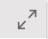

# AM Browser Insight

Insight is a new type of report, Admin user and Power user can save their own reports.

## Visibility
There are two visibility options:

- Public (default):  
    All users who can access the Insight module will have a published graph report called **Overall** from the **Admin** user. All changes Admin made for the **Overall** graph report will be synchronized for other users.
- Self:  
    Define your own graphs report. AM Browser allows you to attach or remove a graph from a report. A graph can be displayed horizontally or vertically, you can also bind two graphs in a row.

## Display styles

There are two modes to present a report:

- Flat (default): Graphs are displayed on a single page as per designed layout.

- Carouse: Graphs are automatically displayed one by one every 10 seconds.

If the interval (10 seconds) is too long to you, click the arrow button to switch to the next graph manually.

>The Graphs of the switch category are displayed.

## Category

Based on your business requirement, you can create different categories as tabs.

To create a new category, enable the Edit mode and then click the **+** button to add a new tab.

To rename a category, in the Edit mode, double-click the tab name to enter a new name.

To remove a category, in the Edit mode, click the **X** button.

## Flexible layout

In the Edit mode, you can create a flexible layout. Each block can be split by row or column. You can attach a Graph in each separated sector.

- Split row
- Split column
- Attach a Graph
- Remove last element

 >Removing a function will remove its attached Graph or the last block. Block cannot remove itself.

## Attach Graphs

In the Edit mode, you can attach a Graph to any block that does not have a sub block in layout.

 Graphs are created in `Graph module` by AMB Admin.

## Single Graph view

To review a graph with more details, click the enlarge button  to enter the expanded mode.
In the expanded mode, AM Browser shows you the graph with a table of records.

## Graph Item view
Click a Graph item, you will get a Record list view to display this item with details. If you continue to click a record, you will get a view with more details.

## Example

Assume that you want to have a view of annual cost of your company.
To do this, you need to go to the builder to create a graph first, and then follow these steps to create a report:

> 1.Before attaching the graph, make sure the graph exists, and it is defined properly.

>2.Decide where you want to put the graph, Public or Self, and if you want to use n existing category or create a new one.

>3.Click Add to create a flexible layout.

>4.Click the **Attach a Graph** button and select a Graph you want to attach.

>5.Click **Row** or **Column** to change the layout organization.

>6.Click **Save** and confirm the modifications.
