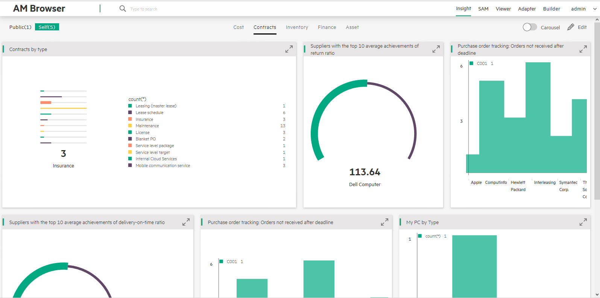

# AM Browser Insight

Insight is a new type of report, Admin user and Power user can save their own reports.

### Visible styles
There are two Visible styles:

- Public(default):You can only accept admin Graphs.
- Self:You can edit your Graphs(like add and delete).

### Display styles

There are two display styles:

- Enable Carouse: Automatically displays Graphs one by one every 10 seconds.

(If you feel 10 seconds too long ,you can jump to the next graph by clicking on the button below the graph.)

- Disable Carousel(default): Displays Graphs on one page as per designed layout.

>Carousel or not Carousel display the Graphs of the switch category.

### Category

Based on your business requirement, you can create different category as tabs.

To create a new category, enable the Edit mode and then click Add Tab.

In the Edit mode, you can also rename a category by double-clicking it.

In the Edit mode, you can also delete a category by clicking Close Tab.

### Flexible layout

In the Edit mode, you can create a flexible layout. Each block can be split by row or column. Then, you can attach a Graph.

- Split row
- Split column
- Attach a Graph
- Remove last element

 >Removing a function will remove its attached Graph or the last block. Block cannot remove itself.

### Attach Graphs

In the Edit mode, you can attach a Graph to any block that does not have a sub block in layout.

 Graphs are created in `Graph module` by AMB Admin.

### Single Graph view

Click each Graph title, get a single view to display this Graph with details.(You should click Expand Tab to show more Grath details.)

### Graph Item view
Click each Graph item,get a Record list view to display this item with details.If continue click each record,will get a view about more details.

### Example:

If you want to count the cost of your company a year,you can create a Histogram by click Builder-->Graph.Then if you want to display it like this:

> 1.You should confirm the Graph is existing.

>2.Find a position you want to create.

>3.Click Add tab to create a flexible layout.

>4.Click Attach a Graph and select a Graph which you want to attach.

>5.You can click Row or Column to change the arrangement of the flexible layout.

>6.Click Save Tab will get a confirm view.You cotinue clik Confirm Button.It will save the Graph.

If you want to see the Graph detials,you should clik Expand Tab.It

If you want to see the Graph item detials,you should click the item.
