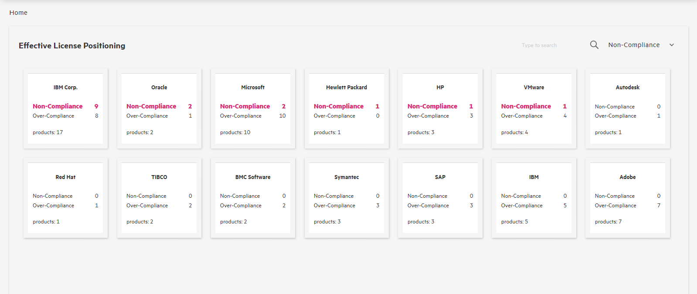
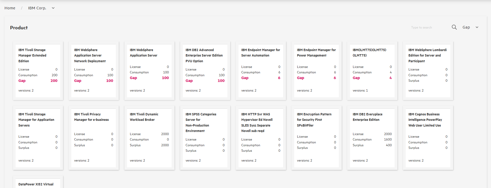
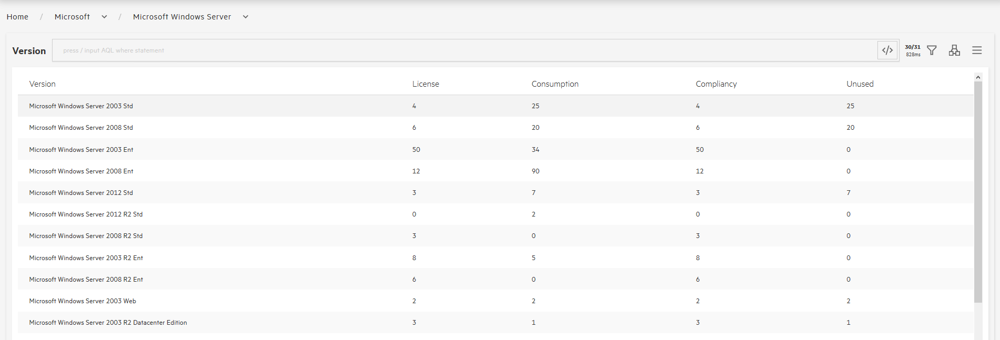
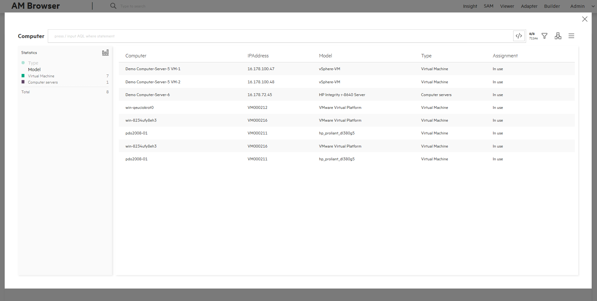
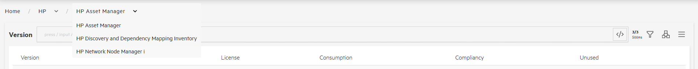

Software Asset Management is an important feature of Asset Manager.
In AM Browser you will find a simplified module that displays the SAM status dashboard. As show in the following sequence:

>  *Effective License Positioning (Vendor)* > *Product* > *Version* > *Computer*

>  *To note: **Non-Compliance** means the license consumption of the product/version is greater than the gained license right points. **Over-Compliance** means the license consumption of the product/version is smaller than the gained license right points.

## Effective License Positioning

- Those software vendors which have software installed or license gained are listed in cards.
- Sorting by **Non-Compliance** or **Over-Compliance** is supported (**Non-Compliance** by default).
- Sorted items are colored in cards.
- You can click the card to switch to the product page.

>   *To note:  if the value of sorting items is zero, we ignore painting them.*

>   *To note:  As a product may contain multiple versions, only when there are at least one version is **Over-Compliance** and no any version is **Non-Compliance**, the product is **Over-Compliance**.

## Product

- The software products of a vendor which have software installed or license purchased are listed in cards.
- Sorting by **Non-Compliance** or **Over-Compliance** is supported (**Non-Compliance** by default).
- Sorted items are colored in cards.
- You can click the card to switch to the version page.

## Version

- The versions of a product which have the version of software installed or corresponding license purchased are displayed in table mode.
- You can click a record to review the computers where this version of the software is installed.

## Computer

- All computers where the particular version of software is installed are listed.
- Computer records are displayed in a pop-up window.
- Records are "grouped by" hardware type by default.

>  Computers are not listed if the particular software is not installed on them.

## Usability

- **Breadcrumb**

  On the top of page, there is a special breadcrumb, each entry of which is a dropdown menu instead of a simple link.  
  By using the menu, AM Browser allows you to navigate to the last level of the vendor or switch among products easily.  
  For instance, you are scanning AssetManager product purchased from vendor HP:

  

  You can switch to other vendors of yours, for example, "*HP Discovery and Dependency Mapping Inventory*" or "*HP Network Node Manager i*."  
  Moreover, you can change vendor at this level by simply selecting one from the vendor drop down menu.

- **Sort Menu**

  A sort menu is added on each card page, allowing you to sort vendors or products with some of their attributes.  
  With this feature, you can sort them with the value of that contained attribute and emphasize them.  
  By default, vendors are sorted with the attribute of **Non-Compliance** and products with **Gap**.

- **Search**

  Next to the sort menu, a search input is implemented enabling you to perfrom quick search for vendors or products.
