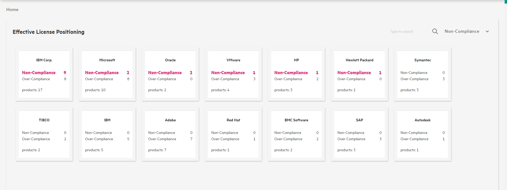
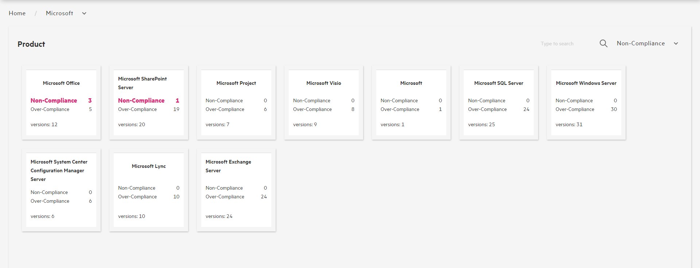

Software Asset Management is an important feature of Asset Manager.
In AM Browser you will find a simple module to display the status dashboard. As below sequence:

>  *Effective License Positioning (Vendor)* > *Product* > *Version* > *Computer*

## Effective License Positioning

- Lists all software vendors and in card format.
- Supports sorting by **Non-Compliance** or **Over-Compliance**.
- Colors sorted items in Cards.
- Sorted by **Non-Compliance** by default.
- Clicks on the card to switch to product page.

>   *To note:  if the value of sorting items is zero, we ignore painting them.*

## Product

- Lists all products of a vendor in cards.
- Supports sorting by **License**, **Consumption**, **Surplus** or **Gap**.
- Colors sorted items in Cards.
- Sorts products by **Gap** by default.
- Clicks on the card to switch to version page.

## Version

- Displays all versions of a product in the table mode.
- Clicks on the record to review computers that this version of software installed on.

## Computer

- Lists out all computers which has particular version installed.
- Displays computer records in the pop-up window.
- Groups by hardware type by default.

>  *Products and versions don't have computers listed if there are no computers installed them.*

# BreadCrumb
At the top of page, we place a special breadcrumb. What makes it different is each entry of the breadcrumb is a dropdown menu instead of a simple link.  
By using the menu, AM Browser allows you to navigate to last level of vendor or switch product freely.  
For instance, you are scanning AssetManager product purchased from vendor HP:

You can switch to your own other products of vendor HP like "*HP Discovery and Dependency Mapping Inventory*" or "*HP Network Node Manager i*".  
Moreover, you can change vendor at this level by simply choose from vendor drop down menu.

# Sort Menu
We add a sort menu at each card page allowing you to sort vendors or products with some of their attributes.  
With this ability, we sort them with value of that contained attribute and emphasize them.  
By default, we sort vendors with attribute of **Non-Compliance** and products with **Gap**.

# Search
Next to sort menu, we implement a search input enabling you to quick search from vendors or products.
