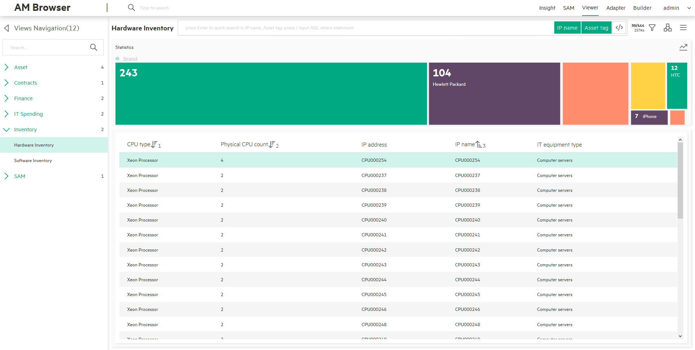
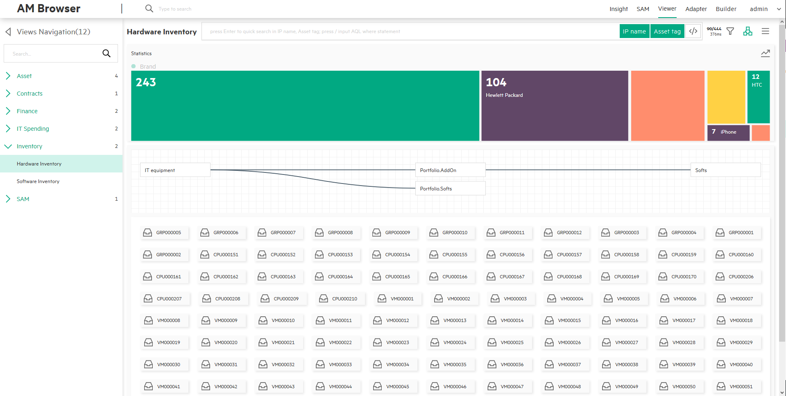

# AM Browser Viewer

The Viewer module is one of the core functionalities of AM Browser. Through views, users are able to see specific reports formed by pre-selected fields.
Before views can be accessed, they have to be defined by the Admin user first.

Three types of users can use views:

- Admin user who can create, modify, delete views and review the results of views.
- Power user who only have read rights to the views defined by admin user.
- Guest user who can access views through a URL, which is published by Admin or Power users.

## WorkSpace

The workspace of a view contains three major areas in the center area of the page:

- Statistics Area
- Header Menu
- Content

> All settings made on a view will be saved in Web Browser's localStorage.  
> Settings include order by, group by parameters and mode of topology, and so on.

### Statistics Area
This area shows the statistics of the group by result. It shows the result in two modes:

 - Legend mode  
    - Located in the left side panel of Content
    - Shows a statistics list with grouped records, the quantity and the sum
    - Can switch to distribution mode by clicking the button at the top right corner
 - Distribution mode
    - Shows statistics result in blocks and distribution way
    - Can switch to Legend mode by clicking the button at the top right corner
    - More details in the Distribution section

### Header menu
A header menu contains the following components:

1. Title
2. Search Input and Search Tags  
    - Instant search
        - Type in a keyword and do not press Enter: AM Browser filters records in the loaded table or topology nodes according to the keyword you typed in.
    - Quick search
        - Type in a keyword and press 'Enter': AM Browser filters from the back-end, it sends formed search query to AM web service to find the matched records. It refreshes table or topology nodes with returned results (**View must have defined searchable fields**)
    - Advanced search (Input AQL filters)
        - Available to Admin and Power user only.
        - Enable or disable this mode by clicking the toggle button or input '/' as the first character.
        - Input example: `Name like '%ABC%' or AssetTag like'123ABC%'`

    - Search tag button
        - AM Browser displays the field name by default, but if the field has an alias, alias is displayed.
        - Each of them can be disabled. Disabled tags are excluded from the searching condition.

3. Record number and response time button
    - Record number
        - Number of loaded records
        - Total number of existing records
        - **Click to get the data on the next page (30 records)**
    - REST response time  

4. Group by filter menu
    - Aggregation - Display aggregation details, users can know which AM table is the view root. Aggregation type: count or sum.
    - Order by - Display the default sequence.
    - Query aggregation - You can click one field, query the aggregation data from the REST service, the result will be displayed in the Aggregation area. You can clear the aggregation result by clicking the field again.  

5. Topology/List mode switch button  
    AM Browser displays contents in table or topology nodes according to the status of this switch button. By default, AM Browser displays the result in table mode.

6. Misc Menu
    - Full column - In table mode, the default number of columns is 5. You can click the full column toggle to display all fields defined for the view.
    - Download CSV - Download the current records as a CSV file.
    - Download PDF
        - Available to all users
        - You can apply defined PDF report template of Personal (defined and owned by yourself) and Public
        - In the pop up PDF template layer, AM Browser opens all functionalities of the PDF template module to you. For example, you can create a new template, modify an existing one, or duplicate from a public template.
        - Generate PDF for a record list with aggregation data without any sub links contents
    - Print BarCode
        - Before printing, you can apply a template in a template management layer
        - Open all functionalities of PDF template in the template management layer
        - Sync all changes with the PDF template management module
        - Number of preview records can be changed as need. It must be larger than 1.
        - Fields to be used for Bar code can be defined.
        > Note: The BarCode printing function is only available in Google Chrome.

### Content
Below the header menu is the content of the report data retrieved from AM web service. It has two modes:

- Table(default mode)
- Topology
> Switch mode by clicking the Topology/table mode switch button on the header menu.  
> By default, AM Browser displays results in table mode.

#### Table mode     
- Header:
    - Field name can be used to perform "order by."
    - Header uses the label name of a field. If it has an alias, the alias is used.
- Column
    - By default, 5 columns are displayed.
    - You can click a record to show details.
    - To load more records, you can either scroll down to the bottom of the page or click the "record number and response time" button next to hourglass on the header menu.

      

- Detail     
 When you click a record, a window pops up on the right side. In the this window, all fields defined in the view will be displayed vertically.
 All 1-M links defined in the view will be displayed on a Tab page.

     - Display all fields
     - Display sub links

 

#### Topology mode
- Display a map of links
- Display each record as a node with an equipment type icon and description text

  

- Detail  
    - To find the details of a node, click the node. The detail page displays a tree map with links of records.
    - When you click a link, AM Browser either expands the link (if the link has child links) or displays all fields in the right side panel.
    - You can export the record to a PDF file.
  

## Distribution
AM Browser Viewer provides a colorful and bright distribution graph to display "group by" statistics. It also provides "fast group by and filter" functions.

- Distribution Graph
    - Horizontal (default)
    - Vertical (enable from menu)
    - Allow to click each element as a filter
- Group by
    - Default "group by" field defined in view
    - Select a field from the filter menu manually
- Filter
    - Display AQL filters added by user
    - Allow multiple filters, condition is 'AND'
