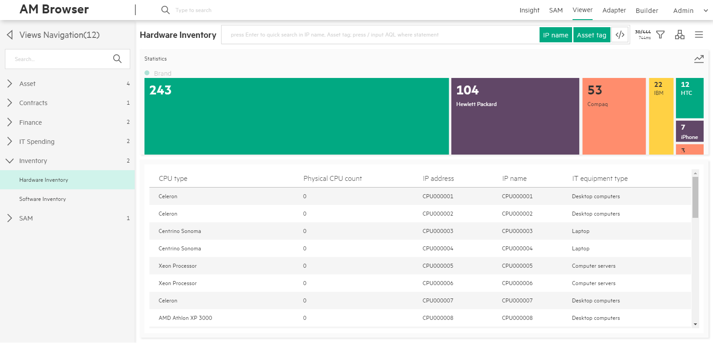

# AM Browser Viewer

The Viewer module is one of the core functionalities of AM Browser. Through views, users are able to see specific reports formed by pre-selected fields.
Before views can be accessed, they have to be defined by the Admin user first.

Three types of users can use views:

- Admin user who can create, modify, delete views and review the results of views.
- Power user who only have read rights to the views defined by admin user.
- Guest user who can access views through a URL, which is published by Admin or Power users.

## WorkSpace

The workspace of a view contains three major areas in the center area of the page:

- Statistics Area
- Header Menu
- Content

> All settings made on a view will be saved in Web Browser's localStorage.  
> Settings include order by, group by parameters and mode of topology, and so on.

### Statistics Area
This area shows the statistics of the group by result. It shows the result in two modes:

 - Legend mode  
    - Located at left side panel of Content
    - Show a statistics list table with fields chosen to be group by, quantity and a number of total at footer
    - Contain switch button to distribution mode on the up-right corner
 - Distribution mode
    - Show statistics result in blocks and distribution way
    - Has a switch button on the up-right corner back to list table mode
    - Check out more details in the Distribution section

### Header menu
A header menu at the bottom of Header navigation contains following components from left to right:

1. Title
2. Search Input and Search Tags  
    - Instant search
        - Type in simply: AM Browser allows you to filter records in the loaded table or topology nodes according to input keywords.
    - Quick search
        - Type in and press 'Enter' then: Filtering from back-end, AM Browser sends formed search query to AM web service to require matching records. It refreshes table or topology nodes with returned results (**View must have defined searchable fields**)
    - Advanced search (Input AQL filters)
        - Available to Admin and Power user only
        - Switch enable and disable mode by pressing toggle button or input '/' as first character
        - Searched AQL filters are displayed below the search input

            Sample: `Name like '%ABC%' or AssetTag like'123ABC%'`

    - Search tag button
        - Display field name by default, but if the field has alias, display alias then
        - Each of them can be disabled. Disabled tags are excluded from searching condition

3. Record Number and response time button
    - Records number
        - Number of loaded records
        - Total number of existing records
        - **Click to get the data on the next page (30 records)**
    - REST response time  

4. Group by filter menu
    - Aggregation - Display aggregation detail, user can know which AM table as view root and aggregation type: count or sum
    - Order by - Display default order by and sequence
    - Query aggregation - Click one fields, query aggregation data from REST service, result will display in Aggregation area. Allow to cancel aggregation result by click field again  

5. Topology/List mode switch button  
    AM Browser either display contents as list table or topology nodes according to the status of this switching button. By default, AM Browser display the result in table mode.

6. Misc Menu
    - Full column - In Table mode, default number of columns are 5, enable full column toggle to display all fields defined for the view.
    - Download CSV - Download records in current contents as CSV file.
    - Download PDF
        - Available to all types of user
        - Allow you to apply defined PDF report template of Personal (defined and owned by yourself) and Public
        - In the pop up PDF template layer, AM Browser opens all functionalities of PDF template module to you. e.g. create a new templates, modify existing one, duplicate from a public template
        - Generate PDF for record list with aggregation data, without any sub links contents
    - Print BarCode
        - Before printing, AM Browser allows you to apply a template within a template management layer
        - Open all functionalities of PDF template in template management layer
        - Sync all changes with PDF template management module
        - Number of preview records is changeable as need. Number of it needs to large than 1.
        - Fields to be used for Bar code generating are definable
        > Note: The BarCode printing function only available in Chrome.

### Content
Under header menu, it is the content of report data retrieved from AM web service. It has two modes:

- Table(default mode)
- Topology
> Switch mode by clicking on Topology/table mode switch button from header menu.  
> By default, AM Browser displays result in table mode

#### Table mode     
- Header:
    - Render Fields name and along with order by icon if the column is chosen to be order by
    - Display Header by label name of field by default, but if it has alias, display alias then
    - To sort, you can click on fields name
- Column
    - By default, 5 columns are displayed.
    - Click a record to show detail.
    - To load more records in, you can either scroll down to bottom of page or click record number and response time button from header menu

      

- Detail     
 When clicking on a record, there will be a popup window from the right side. In the popup window, all fields defined in view will be displayed vertically.
 And all 1-M links defined in the view will be displayed as a Tab page.

     - Display all fields
     - Display sub links

 

#### Topology mode
- Display a map of links
- Display each record as a node which renders an icon according to the type of equipment and text from self description of the record

  

- Detail  
    - To find out the detail of a node, click on the node switching to detail page. That page displays a tree map rendering links of record have
    - Click on a link, AM Browser either expands the link (if the link has child links) or display all fields on the right side panel
    - Download PDF on the right side panel, functioning same as in table mode, allows you to export the record into a pdf file
  

## Distribution
AM Browser Viewer provides a colorful and bright distribution graph to display group by statistics. It also provides a fast group by and filter functions.

- Distribution Graph
    - Horizontal (default)
    - Vertical (enable from menu)
    - Allow to click each element as a filter
- Group by
    - Default group by field defined in view
    - Select a field from filter menu manually
- Filter
    - Display AQL filters that added by user
    - Allow to multiple filters, condition is 'AND'
