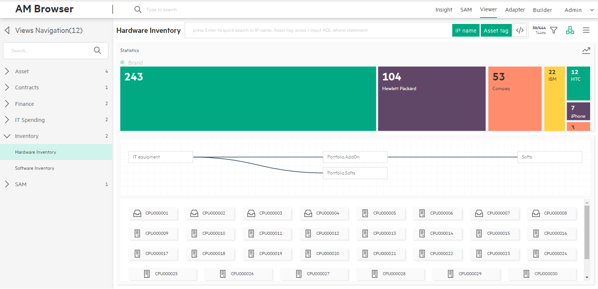

# AM Browser Viewer

Viewer module is one of the core functionality AM Browser has provided. Through views, user are able to see specific reports formed by specified selected data.
Before views can be accessed, they have to be defined by admin user first.

Three types of user using views:

- Admin user - They can create, modify, delete views and review result of view
- Power user - They have only viewing rights to the views defined by admin user
- Guest user - Guest user access views through url address, which is published by above two types user

# WorkSpace

The workspace of view contains three major areas in center area of the page:

- Statistics Area
- Header Menu
- Content

See that layout through screenshot [attach a screenshot]
> All settings on a view will be saved in Web Browser's localStorage.

## Statistics Area
This area intends to showing statistics data of group by result. It can show the result as two mode:

 - List table mode  
        It shows groupby field, its numbers and combine with an number of total under the footer.
        The statistics area is placed on the left side, by default, it is disabled and hidden, only enabled if the view has selected groupby filter.  
 - Distribution mode

[Put on a attahced screenshot]

## Header menu
A header menu at the bottom of Header navigation contains following components from left to right:

1. Title
2. Search Input and Search Tags  
    - Instant search
        - Type in simply: AM Browser allows you to filter records in the loaded table or topology nodes according to input keywords.
    - Quick search
        - Type in and press 'Enter' then: Filtering from back-end, AM Browser sends formed search query to AM web service to require match records. It will refresh table or topology nodes with returned results (**View must have defined searchable fields**)
    - Advanced search (Input AQL filters)
        - Available to Admin and Power user only
        - Switch enable and disable mode by pressing toggle button or input '/' as first character
        - Searched AQL filters are displayed below the search input

            Sample: `Name like '%ABC%' or AssetTag like'123ABC%'`

    - Search tag button
        - Display field name by default, but if the field has alias, display alias then
        - Each of them can be disabled. Disabled tags are excluded from searching condition

3. Record Number and response time button
    - Records number
        - Number of loaded records
        - Total number of existing records
        - **Click to get the data on the next page (30 records)**
    - REST response time  

4. Group by filter menu
    - Aggregation - Display aggregation detail, user can know which AM table as view root and aggregation type: count or sum
    - Order by - Display default order by and sequence
    - Query aggregation - Click one fields, query aggregation data from REST service, result will display in Aggregation area. Allow to cancel aggregation result by click field again  

5. Topology/List mode switch button

6. Misc Menu
    - Full column - In Table mode, record display limit to 5 fields as default, enable full column toggle to display all fields
    - Download CSV - Async generate records by current filter and order to CSV, download it in web browser
    - Download PDF
        - All user can see this drop down menu
        - Display Personal and Public templates
        - User can create/modify/save/delete/duplicate Personal templates and duplicate Public template
        - User can not see other user's Personal templates
        - Generate PDF for record list with aggregation data, without any sub links contents
        - Basic operations please refer to PDF Template
    - Print BarCode
        - User can design his own BarCode template
        - All the settings will be cached
        - User can choose how many records to preview
        - User can choose which field to generate Bar Code
        - User should choose at least 1 field to display Bar Code or there will be an error message, and Preview and Export will be disabled
        - Basic operations please refer to PDF Template

## Content
Under header menu, it is the content of report data retreived from AM web service. It has two modes:

- List (default mode)
- Topology
> Switch mode by clicking on Toplogy/List mode switch button from header menu

### List mode of Content    
- Header: Fields name and order by
    - Display Header by label name of field by default, but if it has alias, display alias then.
    - Clicking fields name will display ascent or descend icon, and query records from back end.
- Column
    - By default, 5 columns are displayed.
    - Click a record to show detail.
      If you scroll down to the bottom, it automatically gets the data of the next page.  

      

- Detail     
 When clicking on a record, there will be a popup window from the right side. In the popup window, all fields defined in view will be displayed vertically.
 And all 1-M links defined in the view will be displayed as a Tab page.

     - Display all fields
     - Display sub links

 

### Topology mode of Content    
- Display each record as icon and its self description
- Lazy load each sub link's records by user expand manually
- Display record all fields in right side panel when clicking each record
- Download PDF - Same with View record detail (one record and its sub links)

  

- Detail  
  Clicking on a record, content switch to a tree map rendering links of record have. Clicking on each link, it either expands the link (if the link still has child links) or display its fields in the right side panel.  
  Download PDF, functioning same as list mode, allow you to export this record as pdf file.
  

## Distribution
AM Browser Viewer provides a colorful and bright distribution graph to display group by statistics. It also provides a fast group by and filter functions.

- Distribution Graph
    - Horizontal (default)
    - Vertical (enable from menu)
    - Allow to click each element as a filter
- Group by
    - Default group by field defined in view
    - Select a field from filter menu manually
- Filter
    - Display AQL filters that added by user
    - Allow to multiple filters, condition is 'AND'

Video:

