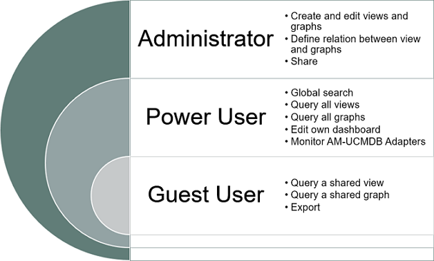

# Asset Manager Browser

HPE Asset Manager Browser (AM Browser) is a lightweight UI that leverages RESTful API layer to pull data from HPE Asset Manager and simplifies the end user data consumption of ITAM data.

### Features

AM Browser provides you with the following features:

- Providing quick access to specific assets information
- Create views in mins and expose the view as both list and topology modes
- Export PDF reports with customized formats and styles (support barcode)
- Allow query data by AQL (AM query language) and flexible customize graphical formats
- Manage divers personal dashboard composited by graphical
- A simple SAM (Software Asset Management) reports module  
- Monitor AM-UCMDB integration status

### Use cases

AM Browser provides you with the following use cases:

### Roles

AM Browser has 3 roles:

