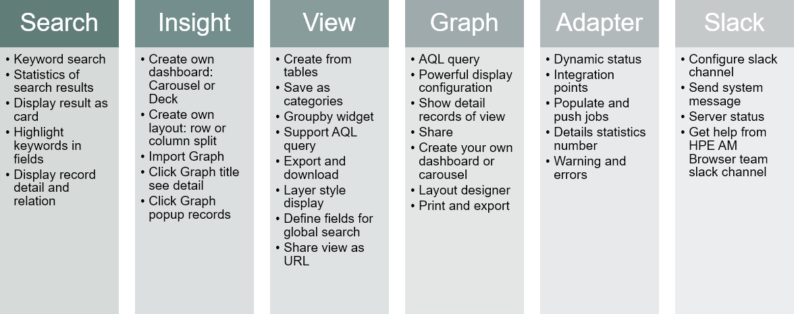

# Asset Manager Browser

HPE Asset Manager Browser (AM Browser) is a lightweight UI that leverages RESTful API layer to pull data from HPE Asset Manager and simplifies the end user data consumption of ITAM data.

### Features

AM Browser provides you with the following features:

- Providing quick access to specific assets information
- Create views in mins and expose the view as both list and topology modes
- Export PDF reports with customized formats and styles (support barcode)
- Allow query data by AQL (AM query language) and flexible customize graphical formats
- Manage divers personal dashboard composited by graphical
- A simple SAM (Software Asset Management) reports module  
- Monitor AM-UCMDB integration status

### Use cases

AM Browser provides you with the following use cases:

**@todo: provide more use cases by text, replace below pictures.**

### Roles

AM Browser has 3 roles:

- Administrator
    - Manage Views, Graphs and PDF Templates
    - Customize My Assets module
    - Share view or graph links by mail
    - Publish Insight tabs to Power users
    - Manage server configuration (backend)
    - Customize icons for each record in Viewer topology mode (backend)
- Power user
    - Global search
    - Query View, Graphs and export data by CSV or PDF
    - Manage personal dashboard (Insight) and view published tabs by Administrator
    - Monitor AM-UCMDB adapters
- Normal user
    - Explorer a shared View
    - Explorer a shard Graph
    - Export CSV and PDF
    - Explorer My Assets

### Change logs

- **1.1**
    - UI and style adjustment
    - Insight as home page, move global search in header
    - New modules: SAM and My Assets (in user menu, default module for normal user)
    - A new topology display mode to display records in Viewer (support customize icon)
    - Records in Viewer can be exported by PDF (report and barcode), support customization
    - Allow to configure condition drill down Graph to View by selection

- **1.0 Update 1**
    - Customized settings of Viewer can be saved in web browser.
    - A confirmation box appears when you try to leave the page with unsaved data (Insight/Builder/Graph).
    - In Global Record Search and Viewer, when a query is being executed, other buttons and links are greyed out to avoid repetitive clicks.
    - UCMDB Adapter is optimized.
    - A stability issue of REST API is fixed.
    - Some usability issues are fixed.

- 1.0
    - Release