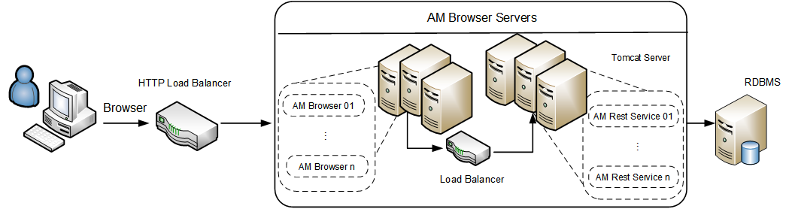
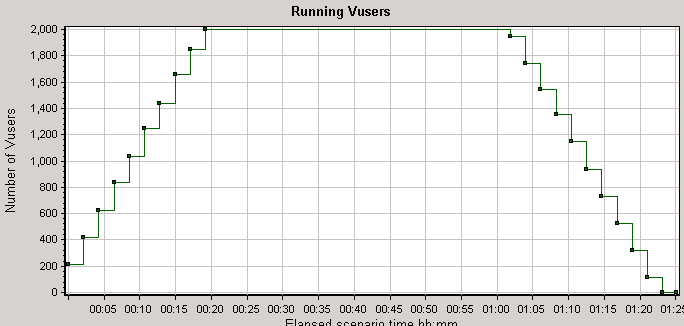
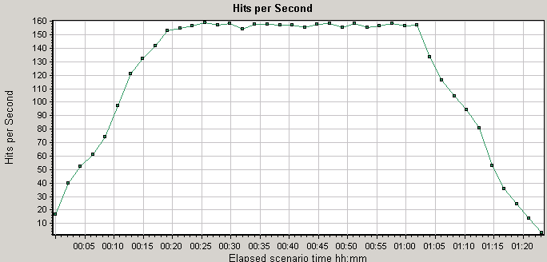
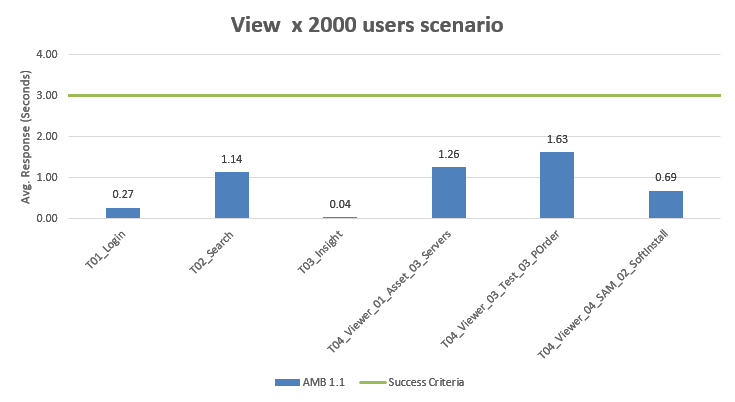

# Appendix A - Asset Manager Browser benchmark sample performance (2,000 users) test results

#### Asset Manager Browser benchmark sample performance (2,000 users) test results
The goal of the benchmark test is to determine the system performance with 2,000 concurrent users.

#### Deployment diagram
For 2,000 concurrent users, our test environment contains 8 Asset Manager Rest Service servers and 4 Asset Manager Browser servers on four machines (with 2 Asset Manager Rest Service and 1 Asset Manager Browser on each machine), two load balancer machines and one database machine.
(Central database for Asset Manager Browser is deployed with Oracle database.)

#### Hardware
Performance tests are executed on virtual machines except the database.
The following table describes the configurations of servers for the 2,000 user benchmark test.

| ID | Usage                                                            | Type             | Operation system | CPU                                   | Memory |
|----|------------------------------------------------------------------|------------------|------------------|---------------------------------------|--------|
| 1  | AM Rest Server                                                   | Virtual Machine  | Windows 2012 R2  | Intel E5 2680 v3@ 2.50 GHz x 8 Cores  | 16 GB  |
| 2  | AM Rest Server                                                   | Virtual Machine  | Windows 2012 R2  | Intel E5 2680 v3@ 2.50 GHz x 8 Cores  | 16 GB  |
| 3  | AM Rest Server                                                   | Virtual Machine  | Windows 2012 R2  | Intel E5 2680 v3@ 2.50 GHz x 8 Cores  | 16 GB  |
| 4  | AM Rest Server                                                   | Virtual Machine  | Windows 2012 R2  | Intel E5 2680 v3@ 2.50 GHz x 8 Cores  | 16 GB  |
| 5  | Load Balancer                                                    | Virtual Machine  | Cent OS 7.0      | Intel E5 2680 v3@ 2.50 GHz x 2 Cores  | 4 GB   |
| 6  | Load Balancer                                                    | Virtual Machine  | Cent OS 7.0      | Intel E5 2680 v3@ 2.50 GHz x 2 Cores  | 4 GB   |
| 7  | Database                                                         | Physical Server  | Oracle Linux 7   | Intel E5 2680 v3@ 2.50 GHz x 48 Cores | 64 GB  |

#### Software
All tests were run on the following software set:

* HPE Load Runner 11.52.0.0
* Apache Tomcat Apache Tomcat 8.0.36 64 bit
* Tengine/2.1.2 (nginx/1.6.2)
* JDK 1.8.0_54 64-bit
* Asset Manager 9.61 Release Build
* Oracle Database 11g Enterprise Edition Release 11.2.0.4.0 64 bit Production

#### Setup and Tuning
Tuning made before test:

Please find in "[appendix](appendix_c.md)" for more details.

#### Test Data
Test data includes:

| Table Name      | Size   | Record Count |
|-----------------|--------|--------------|
| AMHISTORY       | 870 MB | 10M rows     |
| AMSOFTINSTALL   | 174 MB | 1M rows      |
| AMCOMMENT       | 993 MB | 800K rows    |
| AMASSET         | 378 MB | 700K rows    |
| AMPORTFOLIO     | 198 MB | 700K rows    |
| AMCLEASEDETAIL  | 194 MB | 700K rows    |
| AMCOMPUTER      | 181 MB | 600K rows    |
| AMCLEASEDTLDESC | 39  MB | 600K rows    |
| AMPORDLINE      | 138 MB | 500K rows    |
| AMEMPLDEPT      | 142 MB | 400K rows    |
| AMASTCNTRDESC   | 13  MB | 300K rows    |
| AMWFINSTANCE    | 21  MB | 300K rows    |
| AMINVENTMODEL   | 37  MB | 200K rows    |
| AMPORDER        | 53  MB | 200K rows    |

#### Load Test Scenario Setting
- Test will be executed for more than 80 minutes.
- Detailed scenario setting:

    |    User Scenario    |    User Count    |    Peak   Duration    |    Start Time    |    Think   Time        |    Ramp-up Rate                                            |
    |---------------------|------------------|-----------------------|------------------|------------------------|------------------------------------------------------------|
    | AM Browser View     |    2000          |    40 min             |    +0:00:00      |    25 ~ 35s, random    |    24 users every 15 seconds (shared with all scenario)    |

#### Test statistics for 2,000 concurrent user tests
- Maximum running Vusers:  2,000
    

- Average Hit Per Second: 117.509
- Maximum: 160

    

#### Performance testing results 
**Summary test result:**

|    Version                                                  | AM Breowser 1.1 |
|-------------------------------------------------------------|-----------------|
|    Maximum Running Vusers:                                  |    2,000        |
|    Average Throughput   (bytes/second):                     |    4,079,885    |
|    Average Hits per Second:                                 |    117.509      |
|    No. of View Transaction processed                        |    12,000       |

**Key Response Time:**

All the average response time are under 2 seconds.

**Detailed test results: **

| Transaction Name                                  | Average | 90 Percent | Pass   | Fail |
|---------------------------------------------------|---------|------------|--------|------|
| Action_Transaction                                | 6.738   | 7.648      | 12,000 | 0    |
| T00_Load_Login_Page                               | 0.359   | 0.399      | 12,000 | 0    |
| T01_Login                                         | 0.267   | 0.332      | 12,000 | 0    |
| T02_Search                                        | 1.136   | 1.477      | 12,000 | 0    |
| T03_Insight                                       | 0.041   | 0.053      | 12,000 | 0    |
| T04_Viewer_01_Asset_01_Nature                     | 0.138   | 0.174      | 12,000 | 0    |
| T04_Viewer_01_Asset_02_Brands                     | 0.048   | 0.062      | 12,000 | 0    |
| T04_Viewer_01_Asset_03_Servers                    | 1.258   | 1.328      | 12,000 | 0    |
| T04_Viewer_01_Asset_04_Request                    | 0.131   | 0.168      | 12,000 | 0    |
| T04_Viewer_02_Finance_01_Invoice                  | 0.131   | 0.168      | 12,000 | 0    |
| T04_Viewer_02_Finance_02_Contracts_01             | 0.151   | 0.188      | 12,000 | 0    |
| T04_Viewer_02_Finance_02_Contracts_02_Maintenance | 0.05    | 0.062      | 12,000 | 0    |
| T04_Viewer_02_Finance_02_Contracts_03_Detail      | 0.038   | 0.048      | 12,000 | 0    |
| T04_Viewer_03_Test_01_Portfolio_with_ExpenseLines | 0.048   | 0.059      | 12,000 | 0    |
| T04_Viewer_03_Test_02_Request                     | 0.129   | 0.167      | 12,000 | 0    |
| T04_Viewer_03_Test_03_POrder                      | 1.628   | 1.75       | 12,000 | 0    |
| T04_Viewer_03_Test_04_ExpenseLine                 | 0.13    | 0.166      | 12,000 | 0    |
| T04_Viewer_03_Test_05_UCMDB_Asset                 | 0.044   | 0.057      | 12,000 | 0    |
| T04_Viewer_04_SAM_01_Software_Product             | 0.141   | 0.181      | 12,000 | 0    |
| T04_Viewer_04_SAM_02_SoftInstall                  | 0.686   | 0.751      | 12,000 | 0    |
| T04_Viewer_04_SAM_03_SoftModel                    | 0.143   | 0.182      | 12,000 | 0    |
| T09_Logout                                        | 0.013   | 0.015      | 12,000 | 0    |

#### Conclusion
Asset Manager Browser performed acceptably during testing and demonstrated good scalability. 

All of the response time goals, up to the maximum tested concurrent user level of 2,000 users, were met.
Additionally, there was a significant margin for increased workload. 
