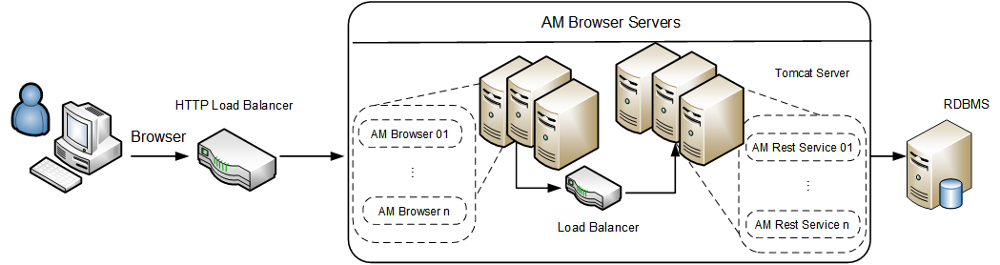

# Appendix B - Asset Manager Browser processing capability test results
#### Introduction
As an online transaction processing systems, the peak processing capability are always concerned by most customers. The results below presents the view capability of Asset Manager Browser with populated test data set. 
#### Result Summary

| User Scenario                                     | No. of Server Instances                                          |Process capability (peak hits per second)|
|---------------------------------------------------|------------------------------------------------------------------|--------------------------------------|
| View Scenario                                     | 1B* + 1R                                                          | 114                                  |
| View Scenario                                     | 1B + 2R                                                          | 210                                  |
| View Scenario                                     | 1B + 4R                                                          | 207                                  |
| View Scenario                                     | 2B + 4R                                                          | 400                                  |
| View Scenario                                     | 4B + 4R                                                          | 458                                  |

*B: Browser Server

R: Rest Server

#### Deployment diagram

#### Hardware
Performance tests are executed on virtual machines except the database.
The following table describes the configurations of servers for the 2,000 user benchmark test.

| ID | Usage                                                            | Type             | Operation system | CPU                                   | Memory |
|----|------------------------------------------------------------------|------------------|------------------|---------------------------------------|--------|
| 1  | AM Rest Server                                                   | Virtual Machine  | Windows 2012 R2  | Intel E5 2680 v3@ 2.50 GHz x 8 Cores  | 16 GB  |
| 2  | AM Rest Server                                                   | Virtual Machine  | Windows 2012 R2  | Intel E5 2680 v3@ 2.50 GHz x 8 Cores  | 16 GB  |
| 3  | AM Rest Server                                                   | Virtual Machine  | Windows 2012 R2  | Intel E5 2680 v3@ 2.50 GHz x 8 Cores  | 16 GB  |
| 4  | AM Rest Server                                                   | Virtual Machine  | Windows 2012 R2  | Intel E5 2680 v3@ 2.50 GHz x 8 Cores  | 16 GB  |
| 5  | Load Balancer                                                    | Virtual Machine  | Cent OS 7.0      | Intel E5 2680 v3@ 2.50 GHz x 2 Cores  | 4 GB   |
| 6  | Load Balancer                                                    | Virtual Machine  | Cent OS 7.0      | Intel E5 2680 v3@ 2.50 GHz x 2 Cores  | 4 GB   |
| 7  | Database                                                         | Physical Server  | Oracle Linux 7   | Intel E5 2680 v3@ 2.50 GHz x 48 Cores | 64 GB  |
| 8  | Loadrunner                                                       | Virtual Machine  | Windows 2008 R2  | Intel E5 2680 v3@ 2.50 GHz x 2 Cores  | 4 GB   |

#### Software
All tests were run on the following software set:

* HPE Load Runner 11.52.0.0
* Apache Tomcat Apache Tomcat 8.0.36 64 bit
* Tengine/2.1.2 (nginx/1.6.2)
* JDK 1.8.0_54 64-bit
* Asset Manager 9.61 Release Build
* Oracle Database 11g Enterprise Edition Release 11.2.0.4.0 64 bit Production

#### Setup and Tuning
Tuning made before test:

Please find in "[appendix](appendix_c.md)" for more details.

#### Test Data
Test data includes:

| Table Name      | Size   | Record Count |
|-----------------|--------|--------------|
| AMHISTORY       | 870 MB | 10M rows     |
| AMSOFTINSTALL   | 174 MB | 1M rows      |
| AMCOMMENT       | 993 MB | 800K rows    |
| AMASSET         | 378 MB | 700K rows    |
| AMPORTFOLIO     | 198 MB | 700K rows    |
| AMCLEASEDETAIL  | 194 MB | 700K rows    |
| AMCOMPUTER      | 181 MB | 600K rows    |
| AMCLEASEDTLDESC | 39  MB | 600K rows    |
| AMPORDLINE      | 138 MB | 500K rows    |
| AMEMPLDEPT      | 142 MB | 400K rows    |
| AMASTCNTRDESC   | 13  MB | 300K rows    |
| AMWFINSTANCE    | 21  MB | 300K rows    |
| AMINVENTMODEL   | 37  MB | 200K rows    |
| AMPORDER        | 53  MB | 200K rows    |

#### Load Test Scenario Setting
* Test will be executed for more than 10 minutes for each user count.
* Detailed scenario setting:

|    User Scenario    |    User Count                          |    Peak   Duration    |    Start Time    |    Think   Time        |    Ramp-up Rate                                            |
|---------------------|----------------------------------------|-----------------------|------------------|------------------------|----------------------------------|
| AM Browser View     | 40 ~ 640 (Test on every 40 increment)  |    10 min             |    +0:00:00      |       0s, random       |    2  users every 3 seconds      |

#### Test results
Processing speed details

| User Scenario                                     | No. of Server Instances                                          |Process capability (peak hits per second)|
|---------------------------------------------------|------------------------------------------------------------------|--------------------------------------|
| View Scenario                                     | 1B* + 1R                                                          | 114                                  |
| View Scenario                                     | 1B + 2R                                                          | 210                                  |
| View Scenario                                     | 1B + 4R                                                          | 207                                  |
| View Scenario                                     | 2B + 4R                                                          | 400                                  |
| View Scenario                                     | 4B + 4R                                                          | 458                                  |

#### Conclusions
The processing capability of Asset Manager Rest Server is about 100 hit per second. 
The processing capability of Asset Manager Browser Server is about 200 hit per second. 
The servers will get best performance if the load are below the maximum processing capability.
Tests proved that the capability can be increased as you add more additional server instances. 

For higher capability or scaling related performance issues such as locking or dead locking, please refer to the tuning section in Help Server.