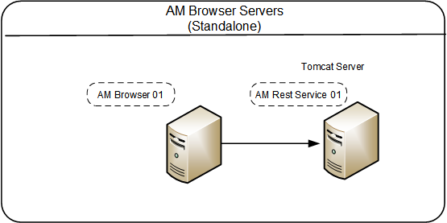
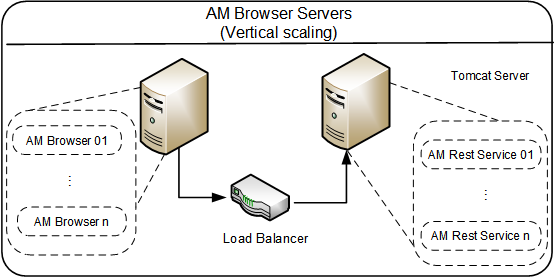
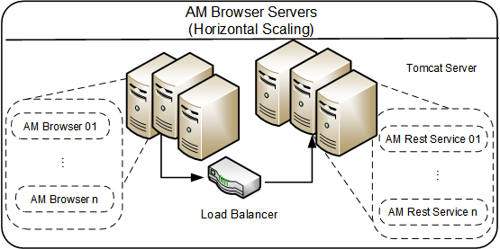
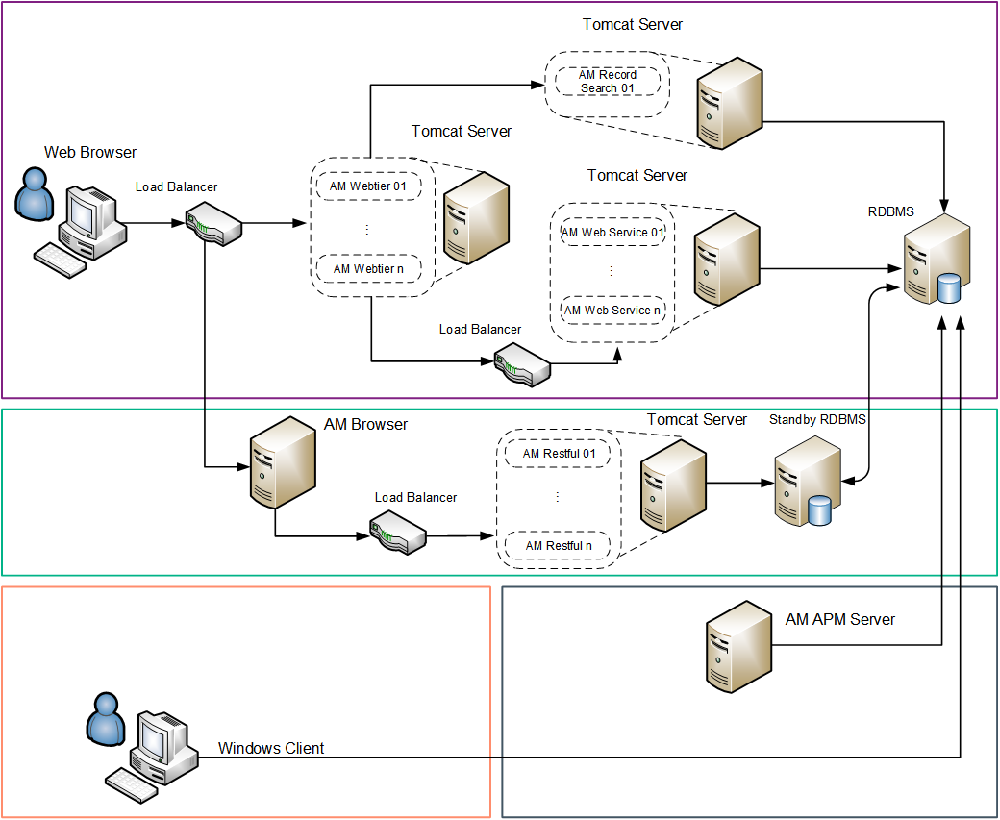

# Asset Manager Deployment models

#### Standalone mode

The Asset Manager standalone model comprises only one Asset Manager Browser Server connecting with one Asset Manager Rest Service. This is the simplest deployment model; you may consider it the base model.

 
#### Vertical scaling mode
The Asset Manager vertical scaling model comprises multiple Asset Manager Rest Service and multiple Asset Manager Browser Servers. Each Rest Service sits in a single Tomcat instance. This implementation is typically used in small to medium-sized environments where hardware system resources are limited. This implementation supports as many client connections as the Asset Manager Web Server has available system resources.

 

#### Horizontal scaling mode
The Asset Manager horizontal scaling model comprises multiple Asset Manager Web Service and multiple Asset Manager Web Tier. Each Web Tier and Web Service sits in a single Tomcat instance. And the Tomcat instances are running on multiple servers.  

A horizontal scaling implementation is typically used in large environments in which system scalability and resilience are concerned. A horizontal scaling implementation can support as many client connections as the sum of the individual Asset Manager instances can support. For example, if each instance can support 250 client connections and there are 4 instances, the system can support 1000 client connections. A horizontal scaling implementation has improved resilience features, such as the ability to stop and start the load balancer process without causing a total system outage and the ability to add a new servlet container process to a virtual group when the system is running.
 
 
#### Sample Asset Manager deployment diagram:

In this diagram, the following events occur: 

* Web browser connects to the Asset Manager Web Tier server. The Web Tier server connects to the Web Services server. Notice that some custom-made, end-user applications could connect directly to the Web Services server. 
* The Asset Manager Web Tier and Web Services logical servers can be installed on the same physical server or on different servers. There can be one or multiple instances of each Web Tier and Web Services logical server. 
* The Asset Manager Web Tier can connect to a Record Search server to enable the ability of record searching.

* Web browser connects to the Asset Manager Browser server. The Asset Manager Browser server connects to the Asset Manager Restful (Rest) servers.
* The Asset Manager Restful logical servers can be installed on the same physical server or on different servers. There can be one or multiple instances of each Restful logical server. 
* It’s recommended to connect Asset Manager Browser server to a standby RDBMS to reduce the production load. However, if there is only a few users using this component, Asset Manager Browser can directly connect to the primary RDBMS.

* The Asset Manager Windows® client (GUI) connects directly to the RDBMS server. 

* The Asset Manager Automated Process Manager (amsrv, aka: APM Server) connects directly to the RDBMS server. There is no direct connection between the Asset Manager Windows GUI or Web Client and the Asset Manager Automated Process Manager.

 

# Asset Manager Browser Server and Rest Server 
**Minimum required reference configurations**

All in one (0 - 100 concurrent users) | Windows and Linux
------------------| ------------------ 
All in one Server | HPE DL360 - 16 CPU cores, 32GB RAM, 4 x 146GB RAID 10 

*For all in one deployment, we recommend that small customers (that is, customers that have fewer than 100 concurrent users) use a small environment deployment in a Windows environment. In a small environment deployment, the following products can be deployed on a single machine: Web Service, Web Tier and the database.*

Small (100-250 concurrent users) | Windows and Linux
------------------| ------------------ 
AM Browser and Rest Server | HPE BL460c – 6 CPU cores, 16GB RAM, 70GB HD
RDBMS | HPE DL585 – 6 CPU cores, 16GB RAM, 4 ~ 6 x 146GB RAID 10

 Medium (250 - 500 concurrent users) | Windows and Linux
------------------| ------------------ 
AM Browser and Rest Server  | HPE BL460c – 12 CPU cores, 24GB RAM, 120GB HD 
RDBMS | HPE DL585 –12 CPU cores, 24GB RAM, 6~8 x 146GB RAID 10 

Large (500 - 1,000 concurrent users) | Windows and Linux
------------------| ------------------ 
AM Browser and Rest Server | HPE BL460c - 24 CPU cores, 32GB RAM, 120GB HD
RDBMS | HPE DL585 - 24 CPU cores, 32GB RAM, 8 x 300GB RAID 10

Very Large (more than 1,000 concurrent users)| 
------------------| ------------------ 
|

*At this size, we recommend that you run Asset Manager on multiple machines in vertical or horizontal scaling mode.*