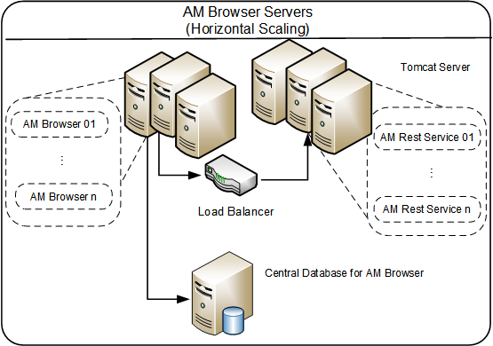

# Rule of thumb
Note: All the web related application servers in this section, if not mentioned, are of 64-bit.
## Asset Manager Browser
Asset Manager Browser is built on an embedded NodeJS server, which is more efficient than the conventional Asset Manager components.

A standard Asset Manager Browser environment with 250 ~ 500 concurrent users requires approximately 2 GB of RAM.

Concurrent User Count | Estimated Memory Usage
------------------| ------------------
250 ~ 500         |     2 GB

 

## Central database for Asset Manager Browser

In Asset Manager Browser 1.1, a central database (MongoDB) is introduced to store all the configurations like views, AQLs, and Graphs.

It is recommended to use central database when Asset Manager Browser is in vertical or horizontal scaling mode.
The database is lightweight and low-cost on resources, so you may deploy it on the same server of Asset Manager Browser.
For horizontal scaling mode that have more than four Asset Manager Browser nodes or for best performance requirement, you may deploy this database server on a dedicated server.

 

## Asset Manager REST Server

The current version of REST Server is mostly based on the Asset Manager Web Service, except the following changes:

* REST Server is only capable of serving RESTful requests in a production environment.
* REST Server does not load web service tags so it will take much shorter time during startup.

There are several `major checkpoints` before going to production:

* Memory:
*Best practice configurations have been already configured during the service installation, increase the value only when needed.*

Concurrent User Count | Estimated Memory Usage
------------------| ------------------
250  | 4 GB (1.75 GB for JVM, 700~900 MB for overhead and cache, 5~10 MB per connection)

* Connection pool configurations (aamapi.ini):

Concurrent User Count | CnxPoolIdleSize | CnxPoolMaxSize
------------------| ------------------ | ------------------
250  | CnxPoolMaxSize - 5 | 500 or higher

For other details on Asset Manager Web Service Server, refer to [Asset Manager 9.60 Deployment Sizing Guide](https://softwaresupport.hpe.com/group/softwaresupport/search-result/-/facetsearch/document/KM02559120)
