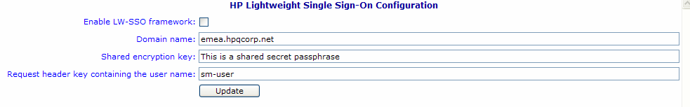

# Overview
When the Lightweight Single Sign-On (LW-SSO) framework is enabled, a user only needs to log on once from a single HPE Software BTO application like SM, Propel during a session to Asset Manager Browser. The user's login information will be propagated to Asset Manager Browser deployed in the same domain.

LW-SSO solves the Web SSO problems for HPE Software BTO products integrated with Asset Manager Browser, using lightweight technology, and without having to install any additional infrastructure.

## Configuring LW-SSO

You can configure LW-SSO "on the fly" on the REST server. The Asset Manager Browser REST Service deployment includes an administration screen to configure basic LW-SSO parameters.

Enter the following URL:

http://${AMBrowserRestServiceServer}:${AMBrowserRestServicePort}/{AMBrowserRestServiceContext}/ssoConfig.jsp

Example:

http://localhost:10081/AssetManagerWebService/ssoConfig.jsp

- Enable LW-SSO framework: When this option is checked, the LW-SSO framework is enabled in the target domain, defined in the next field.
- Domain name: Domain on which user login information is propagated between hosted HPE Software BTO applications which subscribe to a compatible version of LW-SSO. This must be the full DNS name of the application server. For instance: asiapacific.mycompany.net
- Shared encryption key: This is a secret text string that is used as the encryption key for LW-SSO cookies. This is used to populate the initstring parameter. Other HPE Software BTO applications which subscribe to LW-SSO must be configured to use the same initstring to be able to decrypt and share common cookies. 
- Request header key containing the user name: HTTP header responses must make reference to the specified user name. (This can be used to support SSO solutions such as for Siteminder, and so on). As the label suggests, you need only to specify the name of the header key.

Enabling/disabling LW-SSO on the node server

After unzip am browser node zip, user can enable or disable "enable_lwsso" in am-browser-config.properties.default. This will open or close the request to the REST server for LWSSO authentication. Default value is true.

You can refer to the "Asset Manager Web client: Sharing user authentication using Lightweight Single Sign-On (LW-SSO)" chapter in Asset Manager 9.6x documentation for more details.